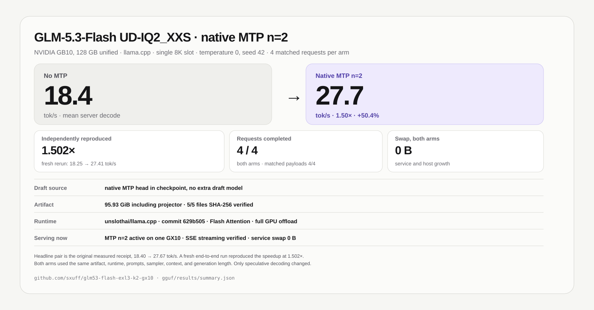

# GLM-5.3 Flash on one NVIDIA GB10

Two pinned, checksum-verified deployment lanes for running GLM-5.3 Flash on one NVIDIA DGX Spark or ASUS Ascent GX10:

1. **Unsloth UD-IQ2_XXS + llama.cpp native MTP n=2**, the new fast and simple GGUF lane.
2. **EXL3 K2 + vLLM native MTP k=2**, the existing 64K EXL3 lane.

Model weights and runtime binaries are not stored in this repository. Every large artifact and runtime is pulled from an immutable revision and verified before use.



## New result: llama.cpp native MTP

One fixed-order sweep used four deterministic text workloads per arm, one warm-up followed by one measured 400-token request per workload. Both arms used the same UD-IQ2_XXS artifact, llama.cpp commit, 8K context, Flash Attention, seed, and request settings.

| Mode | Mean server decode rate | Aggregate whole-request rate |
|---|---:|---:|
| No MTP | 18.40 tok/s | 18.17 tok/s |
| Native MTP n=2 | **27.67 tok/s** | **26.56 tok/s** |

- Mean server decode speedup: **1.50x**, or **+50.36%**
- Aggregate whole-request speedup: **1.46x**
- MTP draft acceptance across all eight warm-up and measured requests: **70.38%**
- Minimum host `MemAvailable`: **17.04 GiB no-MTP**, **13.82 GiB MTP**
- Service swap and host swap growth: **0 bytes in both measured arms**

`Mean server decode rate` is the arithmetic mean of llama.cpp's per-request generation rates. `Aggregate whole-request rate` is 1,600 generated tokens divided by summed request wall time, including prompt processing and first-token latency.

Per-workload values and card copy are in [`gguf/CARD_VALUES.md`](gguf/CARD_VALUES.md). The compact machine receipt is [`gguf/results/summary.json`](gguf/results/summary.json).

## Pick a lane

| Lane | Artifact | Runtime | Measured profile |
|---|---|---|---|
| GGUF | Unsloth UD-IQ2_XXS, 95.93 GiB including projector | llama.cpp | Native MTP n=2, 27.67 tok/s mean decode |
| EXL3 | vcruz305 EXL3 K2, 91.017 GiB | vLLM + ExLlamaV3 | Native MTP k=2, 15.9612 tok/s aggregate decode |

These are separate operational lanes, not a controlled artifact-to-artifact speed comparison. Their quantization, runtime, context allocation, and memory profiles differ.

# Lane A: GGUF + llama.cpp native MTP

## Exact stack

- Hardware: one NVIDIA GB10, 128 GB unified memory, `aarch64`, SM121
- Target: `unsloth/GLM-5.3-Flash-GGUF`
- Target revision: `2975ab414d30340466d8c51533c6e91f0cca64c1`
- Variant: `UD-IQ2_XXS`, four text shards plus BF16 projector
- Verified artifact: 5 files, 103,008,962,080 bytes, 95.93 GiB
- Runtime: `unslothai/llama.cpp` at `629b50552801912b3e2078f9799e4d77213197d7`
- Serving profile: one 8,192-token slot, Flash Attention, full GPU offload, native MTP n=2
- API: OpenAI-compatible llama.cpp server on `127.0.0.1:8001`

## Download, build, and serve

```bash
cd gguf
python3 scripts/download.py \
  --destination "$HOME/models/GLM-5.3-Flash-UD-IQ2_XXS-2975ab41"
./scripts/build_runtime.sh
MODEL_DIR="$HOME/models/GLM-5.3-Flash-UD-IQ2_XXS-2975ab41" \
./scripts/serve.sh
```

The launcher defaults to native MTP n=2. Run the control explicitly with:

```bash
MODE=no-mtp \
MODEL_DIR="$HOME/models/GLM-5.3-Flash-UD-IQ2_XXS-2975ab41" \
./scripts/serve.sh
```

Set `MMPROJ` to the verified projector path when image input is needed. The measured speed arms did not load the projector.

## Reproduce the sweep

Collect one arm per fresh server load:

```bash
python3 scripts/benchmark.py \
  --arm no-mtp \
  --base-url http://127.0.0.1:8001 \
  --output local/no-mtp.json

python3 scripts/benchmark.py \
  --arm mtp-n2 \
  --base-url http://127.0.0.1:8001 \
  --output local/mtp-n2.json

python3 scripts/analyze.py \
  --baseline local/no-mtp.json \
  --treatment local/mtp-n2.json \
  --output local/summary.json
```

Full GGUF instructions, pins, metrics, and artifact hashes are in [`gguf/README.md`](gguf/README.md).

# Lane B: EXL3 K2 + vLLM native MTP

## Verified stack

- Hardware: one NVIDIA GB10, 128 GB unified memory, `aarch64`, SM121
- Model: `vcruz305/GLM-5.3-Flash-EXL3-K2`
- Model revision: `ca0bcdae265f7df1e346c57a2b53b8b8f632ee0b`
- Artifact: 120 safetensors shards, 97,728,721,536 bytes, 91.017 GiB, 120/120 SHA-256 verified
- Quantization: EXL3 K2, 2-bit MCG routed experts; attention, shared experts, embeddings, LM head, and vision remain native BF16
- Upstream recipe: `vcruz305/GLM-5.3-Flash-EXL3-K2-DGX-Spark-recipe` at `0b8dd0d6c7b186076f2e61d1b99a6289f8006c3c`
- Runtime: vLLM `878631b6079d2cf9fb80830ef9cb41b43aded098`, version `0.1.dev62+g878631b60.d20260830`
- Kernels: ExLlamaV3 `17bc3923259ffd48aab742edd261a0ca45d55459`, FlashInfer `0.6.18rc10`
- Framework: PyTorch `2.13.0+cu130`, Python 3.12
- Serving profile: one 65,536-token slot, FP8 KV, fused `exl3_moe`, native MTP k=2, `GPU_MEM_UTIL=0.87`
- API: OpenAI-compatible vLLM server on `127.0.0.1:8888`

Stock vLLM cannot load this artifact. The EXL3 quantization method, Glm5Next architecture, sparse-MLA fixes, and fused routed-expert kernel come from the pinned runtime above.

## Install and run

```bash
python3.12 --version
nvidia-smi
/usr/local/cuda-13.0/bin/nvcc --version
free -h
bash scripts/bootstrap_runtime.sh
source ~/venvs/glm53-exl3-local/bin/activate
bash scripts/download_model.sh
bash scripts/install_service.sh
systemctl --user enable --now glm53-exl3-k2.service
```

The installed profile is:

```text
HOST=127.0.0.1
PORT=8888
SPEC_METHOD=mtp
MTP_TOKENS=2
MAX_MODEL_LEN=65536
MAX_NUM_SEQS=1
MAX_NUM_BATCHED_TOKENS=2048
GPU_MEM_UTIL=0.87
EXL3_FUSED_MOE=1
```

The unit applies `MemoryHigh=108G`, `MemoryMax=112G`, and `MemorySwapMax=0`.

A cold load of the 91 GiB checkpoint takes roughly 11 minutes. Quiet logs during that interval are not evidence of a hang.

## Exercise the service

```bash
python3 scripts/smoke.py --base-url http://127.0.0.1:8888
```

The retained receipt completed 9/9 checks, including structured tool calling and 2/2 native-image checks. See [`results/functional-validation.json`](results/functional-validation.json).

## Measured EXL3 MTP k=2 sweep

Each case used one warm-up plus one measured request, temperature 0, top-p 1, seed 42, thinking disabled, and exactly 400 generated tokens.

| Case | Output tokens | Decode tok/s | MTP drafts accepted | Verified tokens/step |
|---|---:|---:|---:|---:|
| Prose | 400 | 13.2363 | 46.39% | 1.9279 |
| Structured sequence | 400 | 20.2586 | 97.06% | 2.9412 |
| Code | 400 | 16.9598 | 72.39% | 2.4479 |
| Math | 400 | 14.9849 | 59.89% | 2.1978 |
| **Aggregate** | **1,600** | **15.9612** | **66.11%** | **2.3222** |

Across the measured requests, MTP accepted 911 of 1,378 proposed tokens. Minimum host `MemAvailable` was 9,771,429,888 bytes, host swap did not grow, and service swap stayed at 0 bytes.

No matched no-spec speedup is claimed for the EXL3 lane. Full denominators and timing receipts are in [`results/mtp-k2.json`](results/mtp-k2.json).

## Safety

For both lanes, keep at least 6 GiB `MemAvailable`. Stop the owned service if service swap becomes nonzero or whole-host swap grows by more than 512 MiB from the pre-launch baseline.

Inspect before changing context, memory utilization, sequence count, or speculation depth:

```bash
systemctl --user status glm53-exl3-k2.service --no-pager
systemctl --user show glm53-exl3-k2.service \
  -p MemoryCurrent -p MemorySwapCurrent -p MemoryHigh -p MemoryMax -p MemorySwapMax
awk '/MemAvailable|SwapTotal|SwapFree/ {print}' /proc/meminfo
nvidia-smi
```

## Scope

Both result sets are bounded operational sweeps on one GB10. They apply to their exact artifacts, runtimes, settings, contexts, and included workloads.

## License and attribution

Repository scripts and notes are MIT licensed. Model weights are not redistributed and retain their upstream terms. llama.cpp, vLLM, ExLlamaV3, FlashInfer, Unsloth, the EXL3 upstream recipe, and their transitive dependencies retain their own licenses. See [`NOTICE.md`](NOTICE.md).
